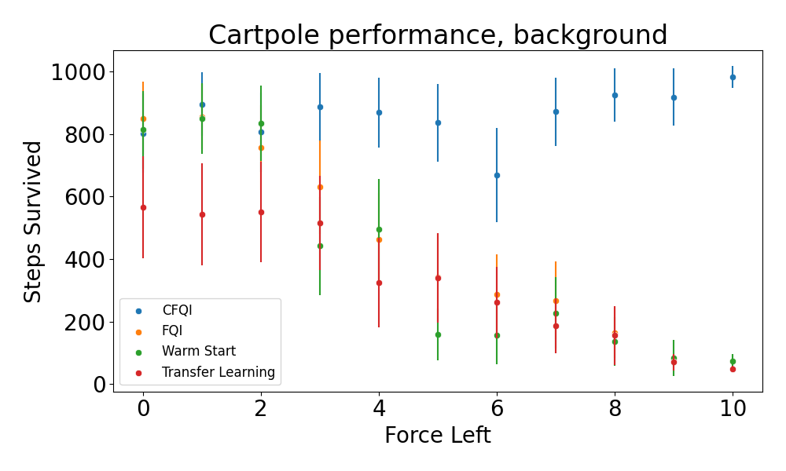
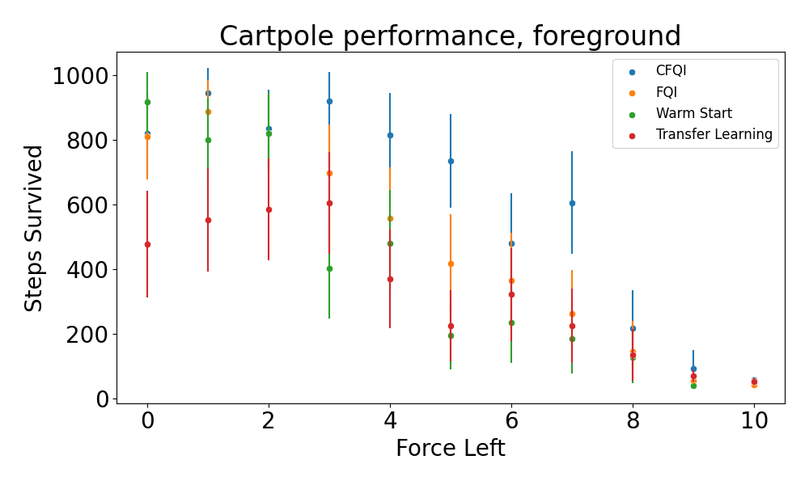

# Nested policy fitted Q-iteration: off-policy reinforcement learning for nested environments


This repository is the official implementation of [Nested Policy Reinforcement Learning](https://arxiv.org/abs/2110.02879).

Off-policy reinforcement learning (RL) has proven to be a powerful framework for guiding agents' actions in environments with stochastic rewards and unknown or noisy state dynamics. In many real-world settings, these agents must operate in multiple environments, each with slightly different dynamics. For example, we may be interested in developing policies to guide medical treatment for patients with and without a given disease, or policies to navigate curriculum design for students with and without a learning disability. Here, we introduce nested policy fitted Q-iteration (NFQI), an RL framework that finds optimal policies in environments that exhibit such a structure. Our approach develops a nested Q-value function that takes advantage of the shared structure between two groups of observations from two separate environments while allowing their policies to be distinct from one another. We find that NFQI yields policies that rely on relevant features and perform at least as well as a policy that does not consider group structure. We demonstrate NFQI's performance using an OpenAI Gym environment and a clinical decision making RL task. Our results suggest that NFQI can develop policies that are better suited to many real-world clinical environments.

## Requirements

To install requirements:

```setup
pip install -r requirements.txt
```

In this repository, we demonstrate how to reproduce results on an OpenAI gym environment. We include code but do not include instructions for preprocessing MIMIC-IV since it is a semi-private dataset available only to authorized users.

## Training

All of the algorithms in this paper are available in simulated_fqi/train.py. To run each of the algorithms (CFQI, FQI, Transfer Learning):

```train
python train.py fqi
python train.py cfqi
python train.py transfer_learning
```

<!-- >📋  Describe how to train the models, with example commands on how to train the models in your paper, including the full training procedure and appropriate hyperparameters. -->

## Evaluation

### Cartpole

CFQI can be evaluated and benchmarked against competing methods in several different settings in the Cartpole environment. Our experiments include testing:

- Overall cumulative reward as the leftward force varies (`simulated_experiments/test_force_range.py`)
- Interpretability using SHAP values (`simulated_experiments/notebooks/neurips_experiments.ipynb`)
- Performance when no difference exists between foreground and background (`simulated_experiments/shuffle_test.py`)
- Performance with sample size imbalance between the foreground and background (`simulated_experiments/sample_size_experiment.py`)

Each of these experiments corresponds to a `.py` file in the `simulated_experiments` directory. Each experiment can be run by calling its respective file. For example, to run the sample size experiment, one can run the following command from a terminal:

`python sample_size_experiment.py`

Each of these experiments outputs a `.json` file containing the results. The plots can be generated using the correspoding files in the `simulated_experiments/plotting` directory.

### MIMIC-IV
We evaluate CFQI on MIMIC-IV by first training CFQI on our MDP as described in the paper. We then evaluate it by generating SHAP plots for renal and non-renal patients and by identifying which
actions are most common. These experimments can be seen in experimental_fqi/mimic-iv_experiments.ipynb. We do not include data or data preprocessing steps because the MIMIC-IV dataset is semi-private.
To become a credentialed user and access the data, visit Physionet (https://physionet.org/content/mimiciv/1.0/). 

## Results

As an example of our results, we show the outcome of the "cumulative reward" experiment in the cartpole environment below (please see paper for full results). We find that CFQI outperforms three competing methods (FQI, warm start, and transfer learning) in both the foreground and background environments.

<p float="left">
  
  
</p>


## Contributing

We include an MIT license. If you would like to contribute to this repository, create a branch and merge with a pull request to the original authors.
If you have questions, please contact the authors (email).
